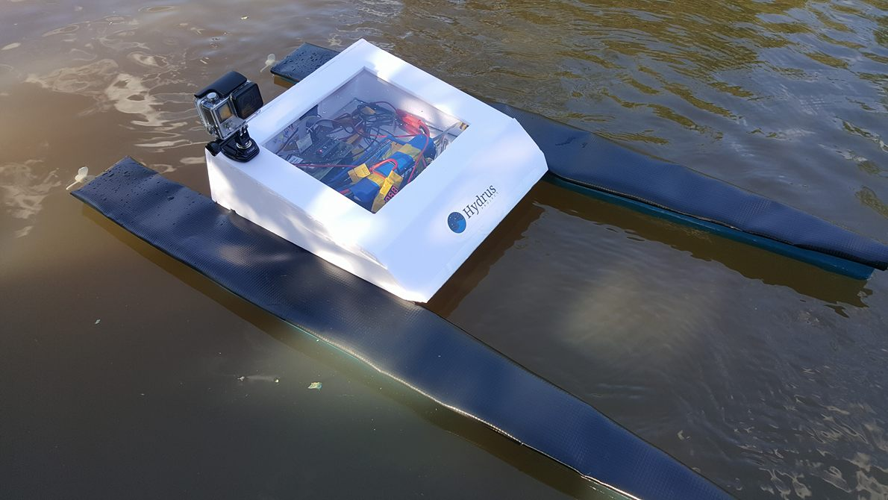
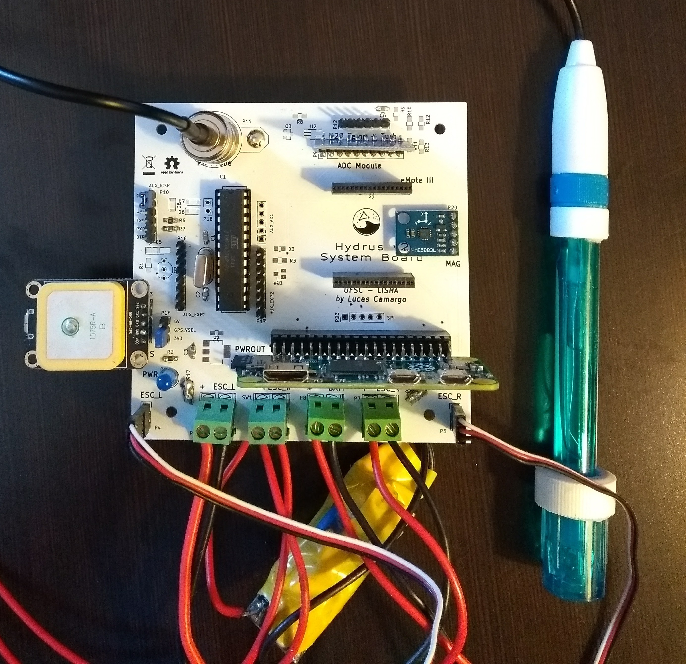
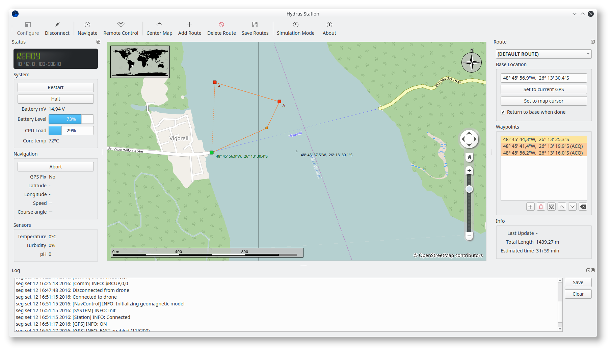

# Hydrus v2

Hydrus is an autonomous surface vehicle for water quality measurement. The original v1 platform won **first place at the Intel Embedded Systems Competition 2016**. This repository contains v2: a ground-up retool of the vehicle firmware and hardware, now running on a **Raspberry Pi Zero W** atop a custom backbone board.

The vehicle navigates a body of water along a pre-planned route, stops at designated waypoints to collect sensor readings, and streams data in real time to a Qt5-based base station running on a laptop.

The project spans embedded firmware, base station software, custom PCB hardware design, and 3D-printed mechanical components.



`Hydrus during field testing on a lake in Joinville, 2016.`

## Hardware

The vehicle runs on a Raspberry Pi Zero W with a custom backbone board that integrates all peripherals:

- **GPS**: u-blox NEO-6 for position and speed
- **IMU**: HMC5883L 3-axis magnetometer for heading
- **ADC**: ADS1115 16-bit I2C ADC multiplexing four analog channels
- **Water sensors**: pH probe, TMP36 temperature sensor, TSD-10 turbidity sensor
- **Propulsion**: dual brushed motors with PWM speed control (differential drive)
- **Power**: LiPo battery with voltage monitoring



`The custom Hydrus v2 System Board, with GPS antenna and pH probe.`

Hardware design files (KiCad schematics and layouts) are in `hw/`. Mechanical parts (propellers, axle adapters, board mounts) are 3D-printable models in `mech/`.

## Firmware

The vehicle firmware (`fw/`) is written in C++11 and built with CMake. It runs four concurrent periodic tasks:

| Task | Rate | Responsibility |
|------|------|----------------|
| `SystemTask` | 2 Hz | State machine, battery/thermal monitoring, shutdown |
| `SensingTask` | 30 Hz | pH, temperature, turbidity, IMU heading |
| `NavigationTask` | 10 Hz | GPS, motor control, waypoint tracking |
| `CommTask` | 20 Hz | TCP link to base station, command routing |

All tasks share a **double-buffered blackboard** with reader-writer locking, which eliminates contention between producers and consumers without blocking.

### Navigation

Autonomous navigation follows a state machine: align to bearing → traverse toward waypoint → acquire data → advance to next waypoint. Distance and bearing use the Haversine formula and forward azimuth calculation against WGS-84 coordinates. Speed is throttled adaptively as the vehicle closes in on a waypoint.

A remote-control mode is also supported, accepting velocity vectors from the base station for manual operation.

## Base Station



`Base station software showing a live mission on the map.`

The base station (`station/`) is a Qt5/C++ desktop application featuring:

- **Live map** via the Marble widget, showing vehicle position, heading, trail, and waypoints over OpenStreetMap tiles
- **Route editor** for building multi-waypoint missions with per-waypoint acquire flags
- **Real-time dashboard** for sensor readings, system state, and battery level
- **Log viewer** with streaming from the vehicle and timeline-based replay
- **RC control widget** with joystick/gamepad support

Communication uses a TCP socket (port 6666). The vehicle streams binary blackboard snapshots and log messages; the base station sends text commands.

## Repository layout

```
doc/      Documentation and branding (including competition presentation)
fw/       Vehicle firmware (C++11, CMake)
lib/      Shared libraries
station/  Base station software (Qt5, C++11)
hw/       PCB schematics and layouts (KiCad)
mech/     3D-printable mechanical components
```

## Credits

The original Hydrus project was developed at Universidade Federal de Santa Catarina. Team members: Guilherme Augusto Pangratz and Emili Bohrer. Mentored by Prof. Dr. Giovani Gracioli.
